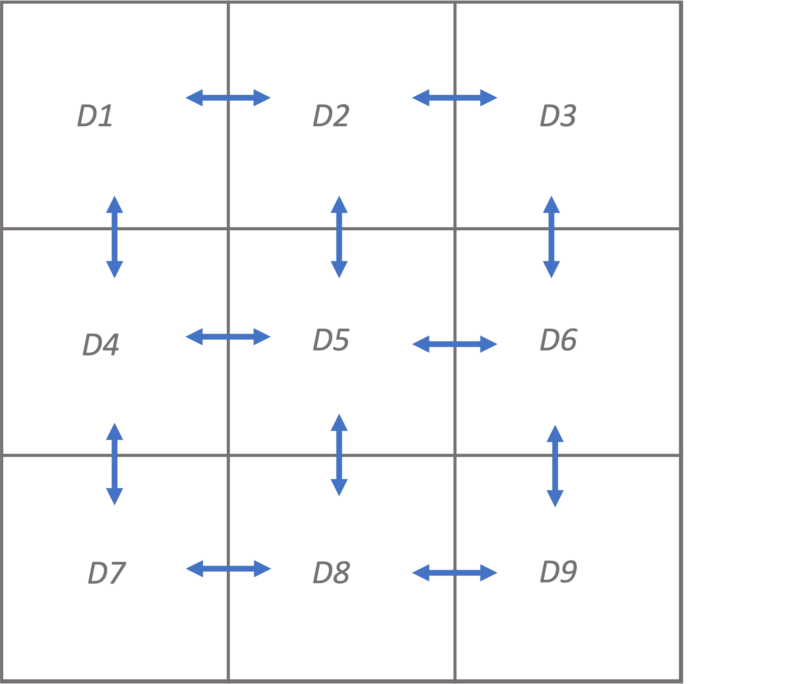
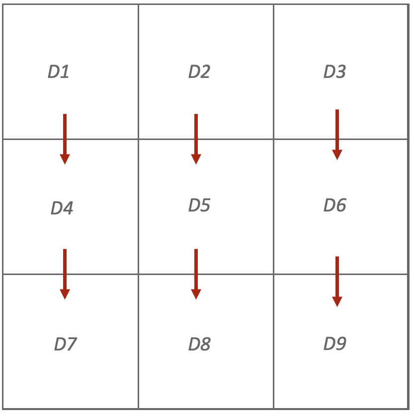

# IBD Simulation Pipeline

This project was created to utilize the combination of Discrete-Time Wright-Fisher model along with the standard Coalescent as suggested [here](https://journals.plos.org/plosgenetics/article/comments?id=10.1371/journal.pgen.1008619). The project has two main parts: **_Grid Simulation_** and **_Admixture Simulation_**. 

## Grid Simulation
As its name suggests, grid simulation simulates a geospatial grid paritioned into `N = Height * Width` demes. Adjacent demes have a migration rate of m that can be set using the `--migration_rate` or `-m` parameter. A migration rate of 0 would result in a set of isolated island simulations, while a migration rate of 0.5 would cause 50% of lineages to traverse among demes which would in effect result in a panmitic population simulation among all demes. Height and width of the grid can be set using `--deme_rows` and `--deme_columns` (or `-x` and `-y`) respectively. The default value for the number of rows and columns is 3.


The number of samples in each deme n can be set using the `--sample_size` or `-s` parameter. If a single sample size is passed, all demes will use that sample size. However, a list of sample sizes can also be passed to modify the share of each deme out of the total samples available in the dataset.

The effective population size, Ne, set using `--ne` flag, follows a similar behaviour. I default value can be set for all demes. Or, a list of values containing effective population size for each deme can be passed to the program.

### Downward Migration Pattern

Grid simulator provides the option to simulate a downward migration from each deme exclusively _to_ the deme that is placed below it. This pattern can be activated using `--migration_dir down` parameter. The default value for migration direction is `all`.


### Discrete Time Wright-Fisher

To realistically simulate IBD patterns, grid simulator uses DTWF model to simulate the first generations before switching to standard coalescent model for efficiency. The number of generations to simulate using DTWF is set using the `--dtwf_duration` or `-d` flag. The default value for this parameter is 50.

### Ancestral Population

All demes are typically drawn from a single ancestral population wit random mating. The effective population size of this population can be set using the `--ancestral_size` or `-a` flag. Not setting a value for this parameter or setting a value smaller than 1 would result in the ancestral population Ne to be set to that of the demes. If demes each have unique Ne values, the ancestral population should also receive its unique Ne value. 

The time for all demes to be separated from the ancestral population, like other time parameters in _msprime_ is measured in generations before the sampling time. It can be set using the `--time_to_merge` or `-t` flag. For example if we pass the parameter `-t 300`, all demes will be merged into the ancestral population 300 generations after the start of the simulation. 

### Recombination

Multiple chromosome can be simulated in a singel simulation. Grid simulator generates a single chromosome with recombination rate of 0.5 among the chromosomes. The parameters `--chr_length` or `-c` sets the length of the simulated chromosome. Passing a list of chromosome lengths to this flag will trigger the simulation of multiple chromosomes with unique lengths. Recombination rate is uniform across each simulated chromosome. This recombination rate can be set using the `--rho` or `-r` parameter. Either a single rate or a list of the rates with the same count as the number of chromosome would be accepted.

Mutation rate is unique across all chromosomes and can be set using the `--mu` or `-m` parameter.

### Reproducability

The random seed for the simulation can be set using the `--random_seed` flag in the grid simulation software. Using the same random seed will result in the exact same results across experiments.

## Software
The parameter
Here is an example of the simulation run with a square 3x3 grid with 100 samples per deme and an effective population size of 10,000 per deme. Migration route is downward only and migraiton rate is 0.05. The first 50 generations will be simulated using DTWF model and generations before will use standard coalescent. A single chromosome will be simulatd with 10 million basepairs and a uniform recombination rate of 1e-7. All demes will be moved to a single panmitic ancestral population after 150 generations.

```bash
python simulate_grid.py --deme_rows 3 --deme_columns 3 
--sample_size 100
--ne 10000
--chr_length 10000000
--migration_rate 0.05
--migration_dir down
--dtwf_duration 50
--time_to_merge 150
--rho 1e-7
--random_seed 1234
```

This code has been tested using Python 3.7.11 and 3.8. Package dependencies are as follows:
```
msprime 1.0.2
tskit 0.3.7
numpy 1.21.1
```
